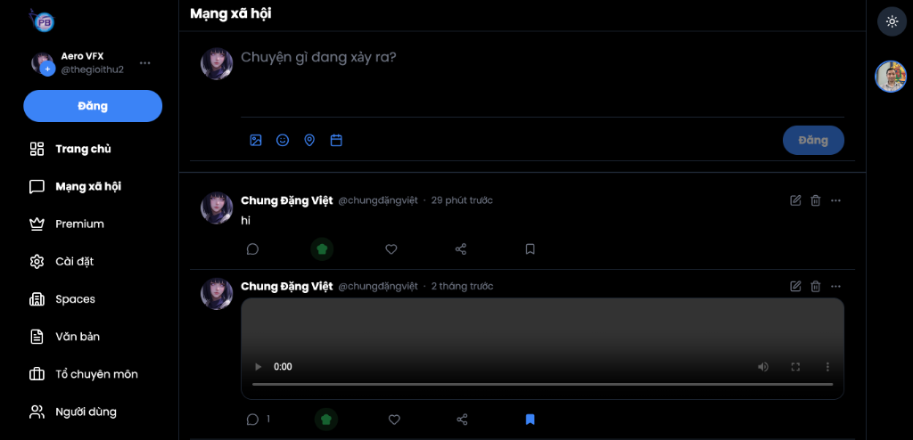

# 🌸 Hệ thống LMS & Mạng Xã Hội THPT Phước Bửu ✨

Chào mừng mấy bồ đến với **THPT Phước Bửu App** nhaaa! 👋🏻 Đâu chỉ là nơi học hành khô khan, trang web nhà mình còn là nguyên cái mạng xã hội cực "cháy" để mọi người tha hồ flex, chém gió và kết nối với nhau đó. Đỉnh chóp chưa nào?! 😎💖

---

## 📸 Giao diện siêu xinh lung linh của tụi mình nè:



---

## 🌟 Chức Năng Chính "Xịn Sò" Kìa

### 1. 📚 Hệ thống Học Tập (LMS) cực chill
- **Quản lý lớp học:** Giáo viên tạo lớp nhanh như chớp, quản lý siêu dễ ⚡️
- **Đăng ký môn học:** Học sinh click 1 phát là vào lớp liền nè 🎓
- **Nộp & Chấm bài:** Quên deadline là xíu nữa khóc đó nha 😂 Giáo viên thả feedback thả ga!
- **Bảng thông báo:** Có update gì mới là hệ thống báo "ting ting" liền 🔔

### 2. 💬 Mạng xã hội 10 điểm không có nhưng
- **Status & Bài đăng:** Tha hồ đăng bài sống ảo, flex ảnh góc nghiêng thần thánh ✨
- **Thả comment & Rep:** Bình luận dạo mọi lúc mọi nơi 💬
- **Thích "tới bến":** Rải tim ❤️ cho mấy post xịn
- **Add friend:** Bấm kết bạn để mở rộng "vòng tròn xã hội" nhaaaa 👫

### 3. 🗂 Kho Văn Bản Thông Minh
- **Kho tàng tài liệu:** Up sương sương đề cương, báo cáo đồ đó 📑
- **Chia quyền:** Ai được coi, ai không được coi? Admin quản hết! 🔐
- **Seach "thần tốc":** Gõ phát ra luôn, không lo mò mẫm 🔎

### 4. 👑 Dành cho User
- Lập tài khoản xịn, đăng nhập mượt mà 🦋
- Phân vai đàng hoàng nha: **Admin, Giáo viên, Học sinh, Phụ huynh** 🎓
- Lên đồ cho profile (avatar, cover, bio) cho thật slayyyy 💅🏻

---

## 💻 Đồ nghề công nghệ (Tech Stack) 🛠

Team tui xài đồ xịn không đó nha 😎:
- **Frontend cực mượt:** `Next.js 14` (App Router) + `React 18` + `Tailwind CSS` (Giao diện auto đẹp) 🎨
- **Mobile Cực Đỉnh:** `Flutter` (App lướt mướt như crush rep inbox) 📱
- **Backend vèo vèo:** `API Routes` của Next.js + `PostgreSQL` (+ `Prisma` để query nhanh gọn nhẹ) ⚡
- **Bảo mật & Auth:** `NextAuth.js` đàng hoàng, login bằng Google cũng okay luôn 🔐
- **Real-time:** `WebSocket/Pusher` chém gió real-time 💬
- **Deployment:** Bay thẳng lên mây với `GCP Cloud Run` & `Cloud Storage` ☁️

---

## 🚀 Cài đặt máy nhà thế nào nè?

Đọc kỹ hướng dẫn sử dụng trước khi dùng nha:

### Lên đồ cho Web App (Next.js) 💻
```bash
# Tải mấy ẻm dependencies về
npm install

# Đổi tên file env để xài
cp .env.example .env.local

# Generate database
npm run db:generate

# Lên lunn (chạy web)! 🚀
npm run dev
```

### Lên đồ cho Mobile App (Flutter) 📱
```bash
# Chui vô thư mục mobile
cd mobile_app

# Kéo thư viện nhe
flutter pub get

# Chạy thuiiiii
flutter run
```

---

## 🔮 Tương lai còn có gì hot? (Sắp ra mắt) 😉
- [ ] Up file xịn sò cho bài tập 📂
- [ ] Noti nảy liên tục kiểu thời gian thực 🔔
- [ ] Inbox / chat riêng thả thính 💬
- [ ] Gọi Video call nhóm trong lớp 🎥
- [ ] App mobile bản chính thức lướt mượt 📱

---

Cảm ơn mấy tình yêu đã đọc tới đây nha! 💖 Chúc mấy bồ xài web chill chill dzui dzẻ 😘 Nếu thấy xịn thì cho tui 1 sao (Star) trên Github lấp lánh lun nghen ⭐!

*Made with love by THPT Phước Bửu Team 🍓✨*
