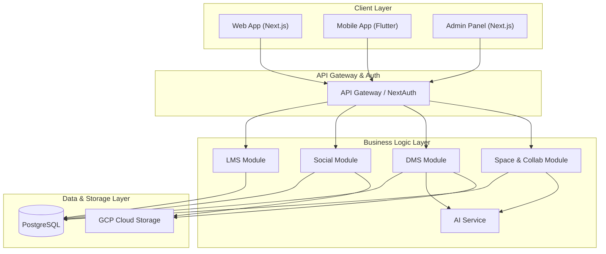

# Hệ thống LMS Trường học với Tính năng Mạng xã hội

Dự án website trường học dựa trên kiến trúc LMS (Learning Management System) với các tính năng mạng xã hội giống Facebook và quản lý văn bản.

## Tính năng chính

### 1. Hệ thống LMS
- **Quản lý lớp học**: Tạo và quản lý lớp học, môn học
- **Đăng ký lớp**: Học sinh có thể đăng ký vào các lớp học
- **Bài tập**: Giáo viên tạo bài tập, học sinh nộp bài
- **Chấm điểm**: Giáo viên chấm điểm và đưa ra phản hồi
- **Thông báo**: Thông báo lớp học và hệ thống

### 2. Mạng xã hội
- **Đăng bài**: Tạo và chia sẻ bài viết
- **Bình luận**: Bình luận trên các bài viết
- **Thích**: Thích và bỏ thích bài viết
- **Kết bạn**: Gửi và chấp nhận lời mời kết bạn
- **Timeline**: Xem dòng thời gian hoạt động

### 3. Quản lý văn bản
- **Tải lên**: Tải lên các loại văn bản (thông báo, chính sách, báo cáo, biểu mẫu)
- **Phân loại**: Phân loại văn bản theo loại và danh mục
- **Quyền truy cập**: Quản lý quyền xem và tải xuống
- **Tìm kiếm**: Tìm kiếm văn bản theo tiêu đề, loại, người tải lên

### 4. Quản lý người dùng
- **Đăng ký/Đăng nhập**: Hệ thống xác thực người dùng
- **Vai trò**: Quản trị viên, Giáo viên, Học sinh, Phụ huynh
- **Hồ sơ**: Quản lý thông tin cá nhân

## Công nghệ sử dụng

### Frontend & Mobile
- **Web App**: Next.js 14 (App Router), React 18, TypeScript
- **Mobile App**: Flutter, Dart
- **Styling**: Tailwind CSS (Web), Flutter Material Design (Mobile)
- **State Management**: React Context/Hooks (Web), Provider/Riverpod (Mobile)

### Backend & Database
- **API Runtime**: Next.js API Routes (Serverless ready)
- **Database**: PostgreSQL (via Prisma ORM) with Prisma Accelerate
- **Authentication**: NextAuth.js (Web), JWT & Google OAuth (Mobile)
- **Real-time**: WebSocket / Pusher
- **AI Integration**: OpenAI API (GPT-4) cho xử lý văn bản và tự động hóa

### Infrastructure
- **Cloud Platform**: Google Cloud Platform (GCP)
- **Storage**: GCP Cloud Storage
- **Deployment**: Google Cloud Run (Containerized)
- **CI/CD**: Cloud Build / GitHub Actions

## Cài đặt nhanh

### 1. Web App (Next.js)
```bash
npm install
cp .env.example .env.local
npm run db:generate
npm run dev
```

### 2. Mobile App (Flutter)
```bash
cd mobile_app
flutter pub get
flutter run
```

## Kiến trúc hệ thống

Dự án được thiết kế theo kiến trúc hướng dịch vụ (Service-Oriented Architecture - SOA) hiện đại, đảm bảo tính mở rộng và bảo mật.



## Cấu trúc dự án

```
├── app/                    # Next.js App Router (Frontend + API Routes)
│   ├── api/               # API endpoints
│   ├── dashboard/         # Trang dashboard chính
│   ├── (auth)/            # Login, Register, Forgot Password
│   └── ...                # Các module chức năng khác
├── mobile_app/            # Flutter Mobile Application
│   ├── lib/               # Mã nguồn Dart
│   └── assets/            # Tài nguyên hình ảnh, font
├── components/            # Thư viện React components chung
├── lib/                   # Utilities, Prisma client, Auth config
├── prisma/               # Database schema & migrations
├── public/               # Static assets (Web)
└── scripts/              # Scripts vận hành và deployment
```

## Database Schema

### User Roles
- `ADMIN`: Quản trị viên
- `TEACHER`: Giáo viên
- `STUDENT`: Học sinh
- `PARENT`: Phụ huynh

### Document Types
- `ANNOUNCEMENT`: Thông báo
- `POLICY`: Chính sách
- `REPORT`: Báo cáo
- `FORM`: Biểu mẫu
- `OTHER`: Khác

## Tính năng trong tương lai

- [ ] Upload file cho bài tập và văn bản
- [ ] Thông báo real-time
- [ ] Chat trực tuyến
- [ ] Video call cho lớp học
- [ ] Báo cáo và thống kê chi tiết
- [ ] Mobile app

## License

MIT

