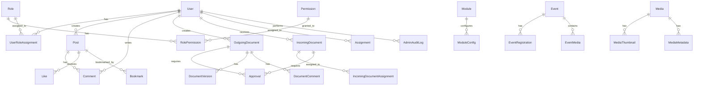
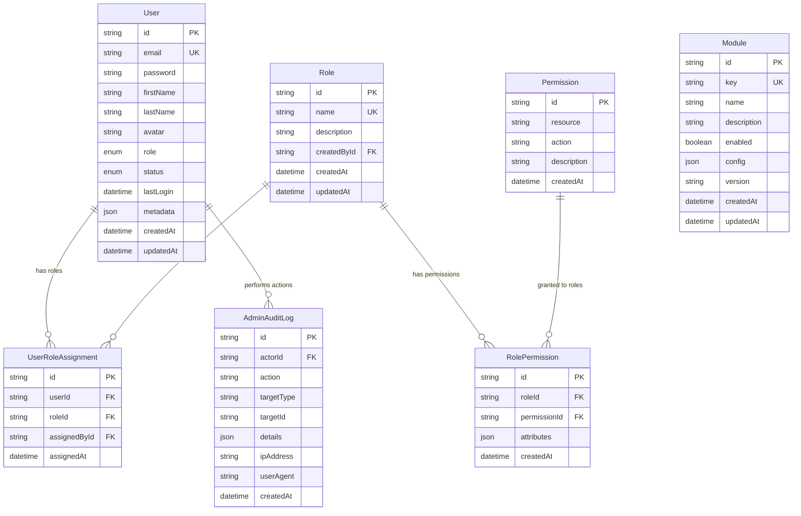
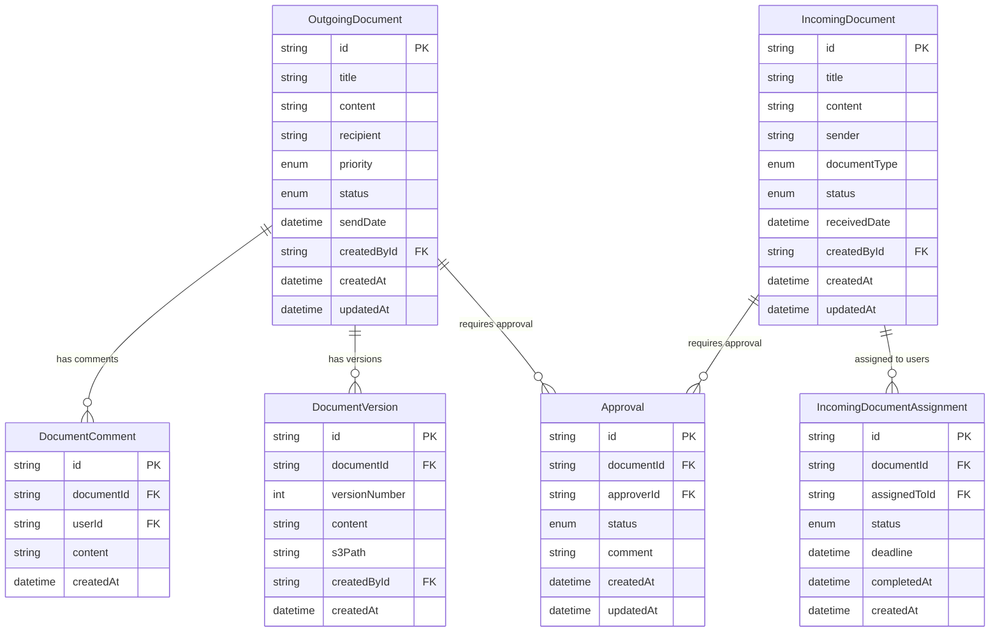
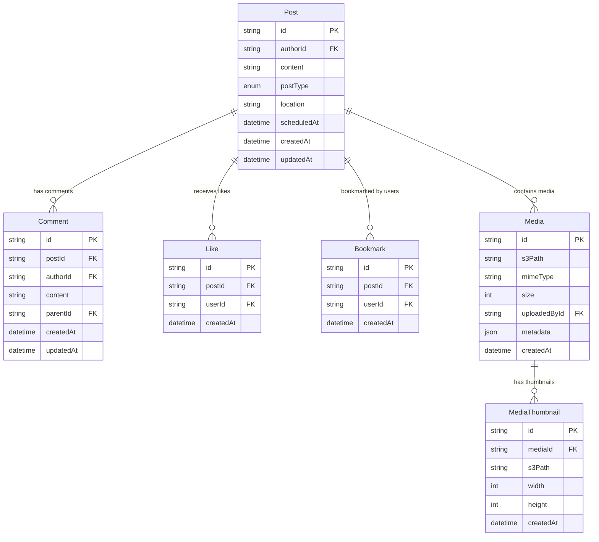
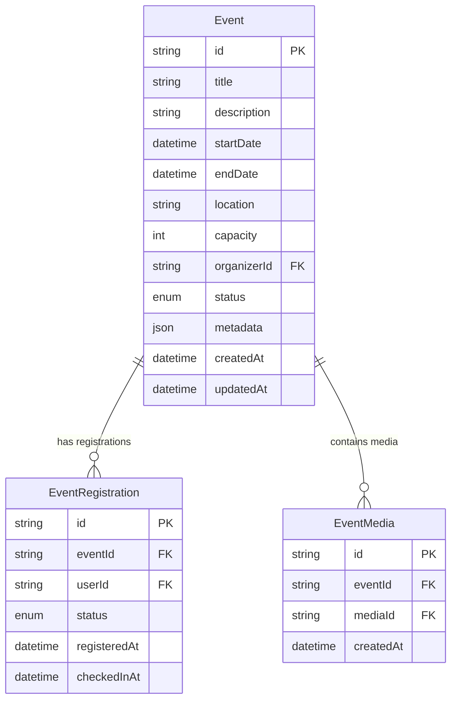

# ERD - Entity Relationship Diagram

## Tổng quan Database Schema



## Chi tiết các bảng chính

### 1. User Management & RBAC



### 2. Document Management System (DMS)



### 3. Content Management (Posts, Comments, Media)



### 4. Events & Calendar



### 5. Learning Management System (LMS)

```mermaid
erDiagram
    Class {
        string id PK
        string name
        string code UK
        string teacherId FK
        string description
        datetime createdAt
        datetime updatedAt
    }
    
    ClassEnrollment {
        string id PK
        string classId FK
        string userId FK
        datetime enrolledAt
    }
    
    Assignment {
        string id PK
        string classId FK
        string title
        string description
        datetime dueDate
        string createdById FK
        datetime createdAt
        datetime updatedAt
    }
    
    Submission {
        string id PK
        string assignmentId FK
        string studentId FK
        string content
        string filePath
        enum status
        datetime submittedAt
        datetime gradedAt
    }
    
    Grade {
        string id PK
        string submissionId FK
        string teacherId FK
        float score
        string feedback
        datetime createdAt
    }
    
    Class ||--o{ ClassEnrollment : "has students"
    Class ||--o{ Assignment : "has assignments"
    Assignment ||--o{ Submission : "receives submissions"
    Submission ||--o{ Grade : "has grade"
```

## Relationships Summary

### User Relationships
- **User → UserRoleAssignment**: Một user có nhiều role assignments
- **User → Post**: Một user tạo nhiều posts
- **User → OutgoingDocument**: Một user tạo nhiều outgoing documents
- **User → IncomingDocumentAssignment**: Một user được assign nhiều incoming documents
- **User → AdminAuditLog**: Một user thực hiện nhiều audit logs

### Document Relationships
- **OutgoingDocument → Approval**: Một document cần nhiều approvals
- **OutgoingDocument → DocumentVersion**: Một document có nhiều versions
- **IncomingDocument → IncomingDocumentAssignment**: Một document được assign cho nhiều users

### Content Relationships
- **Post → Comment**: Một post có nhiều comments
- **Post → Like**: Một post nhận nhiều likes
- **Post → Media**: Một post chứa nhiều media files

### RBAC Relationships
- **Role → RolePermission**: Một role có nhiều permissions
- **Role → UserRoleAssignment**: Một role được assign cho nhiều users
- **Permission → RolePermission**: Một permission được grant cho nhiều roles

## Indexes & Performance

### Critical Indexes
```sql
-- User indexes
CREATE INDEX idx_users_email ON users(email);
CREATE INDEX idx_users_role ON users(role);
CREATE INDEX idx_users_status ON users(status);

-- Document indexes
CREATE INDEX idx_outgoing_docs_created_by ON outgoing_documents(createdById);
CREATE INDEX idx_outgoing_docs_status ON outgoing_documents(status);
CREATE INDEX idx_incoming_docs_assignments ON incoming_document_assignments(assignedToId);

-- Post indexes
CREATE INDEX idx_posts_author ON posts(authorId);
CREATE INDEX idx_posts_created_at ON posts(createdAt DESC);

-- RBAC indexes
CREATE INDEX idx_role_permissions_role ON role_permissions(roleId);
CREATE INDEX idx_user_roles_user ON user_roles(userId);
CREATE INDEX idx_audit_logs_actor ON admin_audit_logs(actorId);
CREATE INDEX idx_audit_logs_created_at ON admin_audit_logs(createdAt DESC);
```

## Data Types & Constraints

### Enums
- **UserRole**: ADMIN, TEACHER, STUDENT, PARENT
- **UserStatus**: ACTIVE, SUSPENDED, DELETED, PENDING
- **DocumentStatus**: PENDING, PROCESSING, APPROVED, REJECTED, COMPLETED, ARCHIVED
- **PostType**: TEXT, IMAGE, VIDEO, LINK
- **ApprovalStatus**: PENDING, APPROVED, REJECTED, RETURNED

### Constraints
- Email must be unique
- Role name must be unique
- Permission (resource, action) must be unique
- User-Role assignment must be unique
- Document version number must be unique per document

