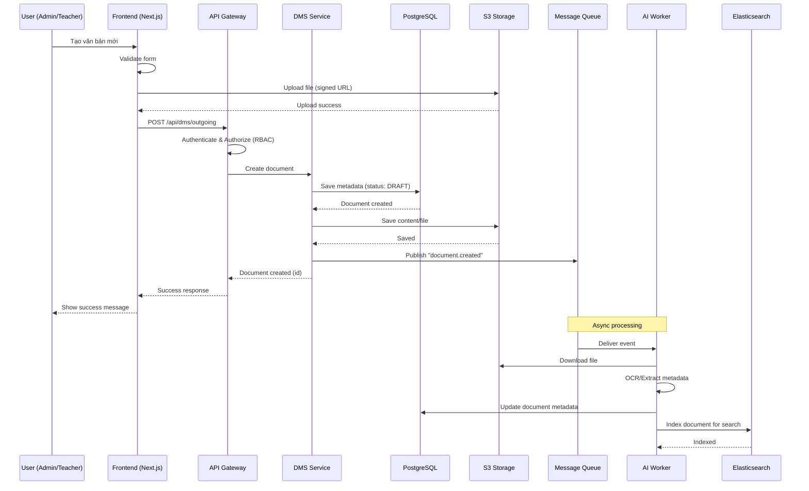
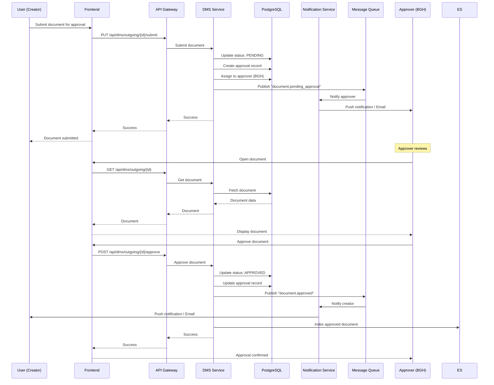
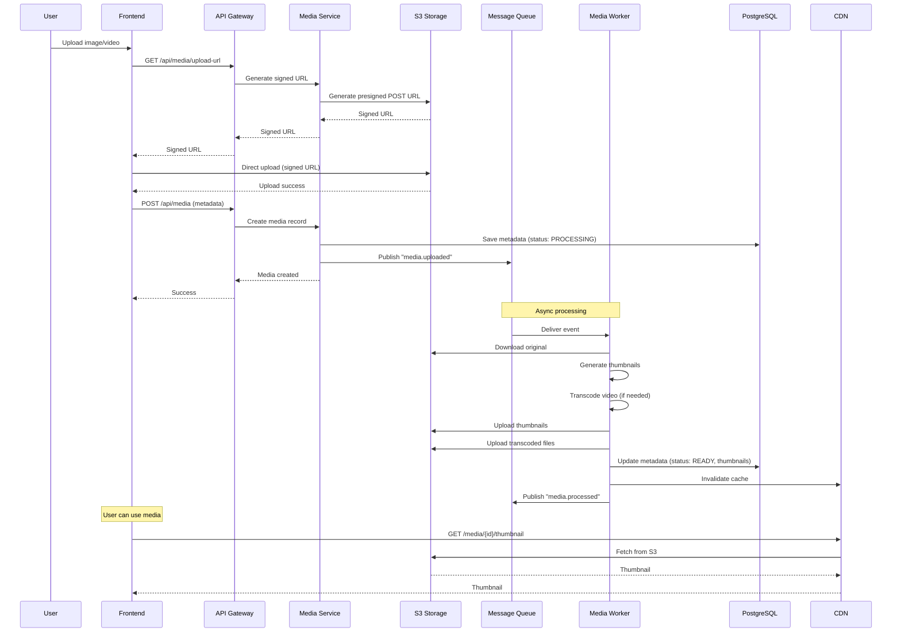
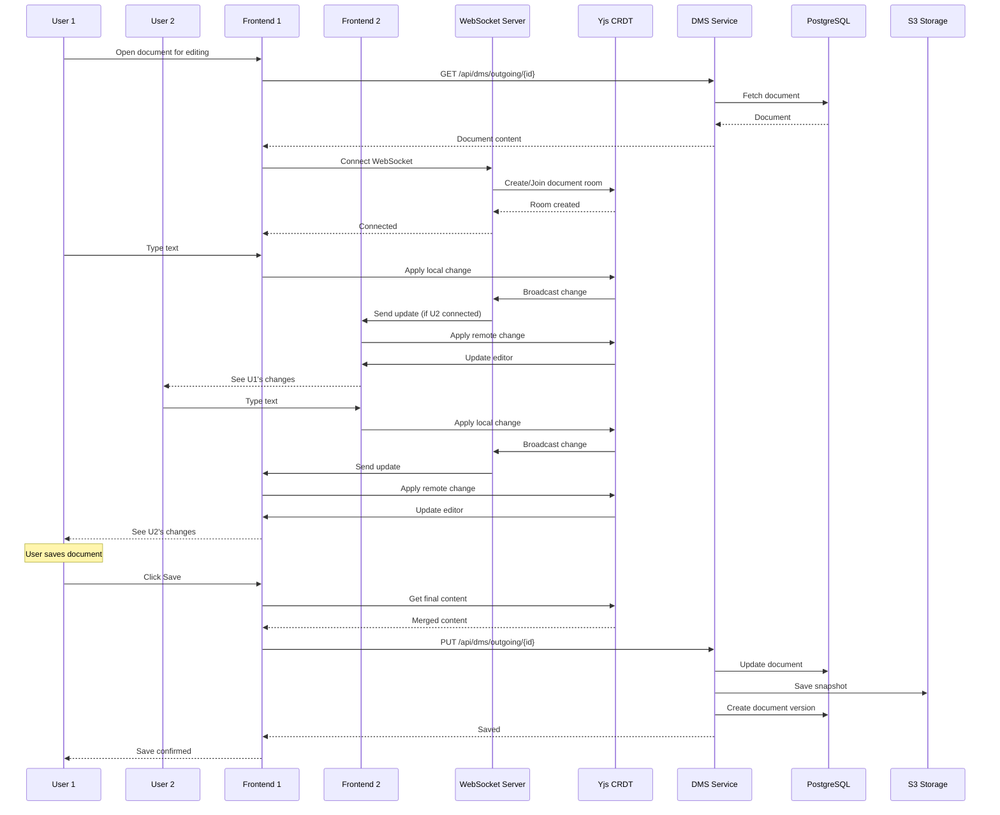
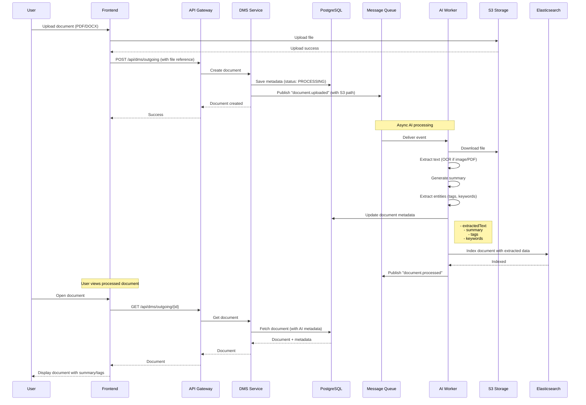
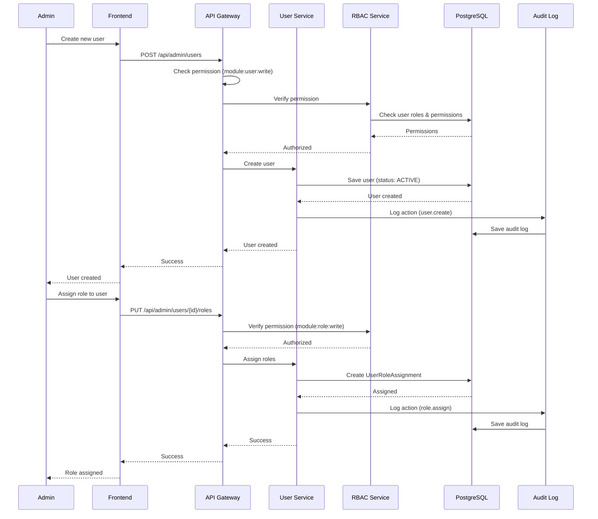
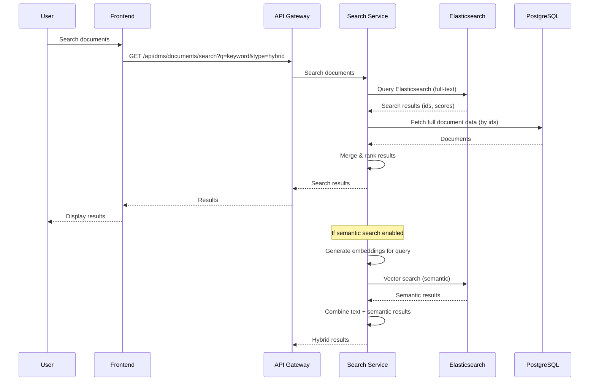
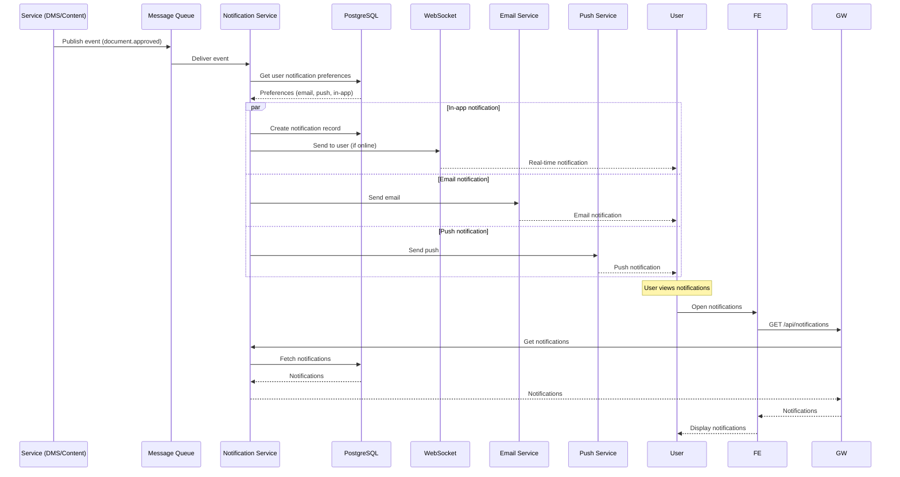

# Sequence Diagrams - Use Cases

## 1. Đăng bài / Tạo văn bản (DMS)

## 2. Duyệt văn bản (Approval Workflow)

## 3. Media Upload & Processing

## 4. Realtime Collaborative Editor

## 5. AI Content Processing (OCR, Summarization)

## 6. User Management & RBAC

## 7. Search Documents (Full-text Search)

## 8. Notification Flow

